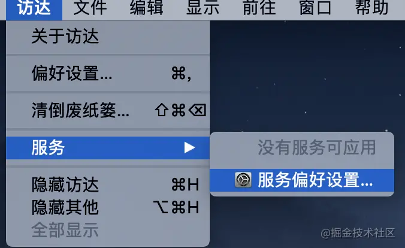
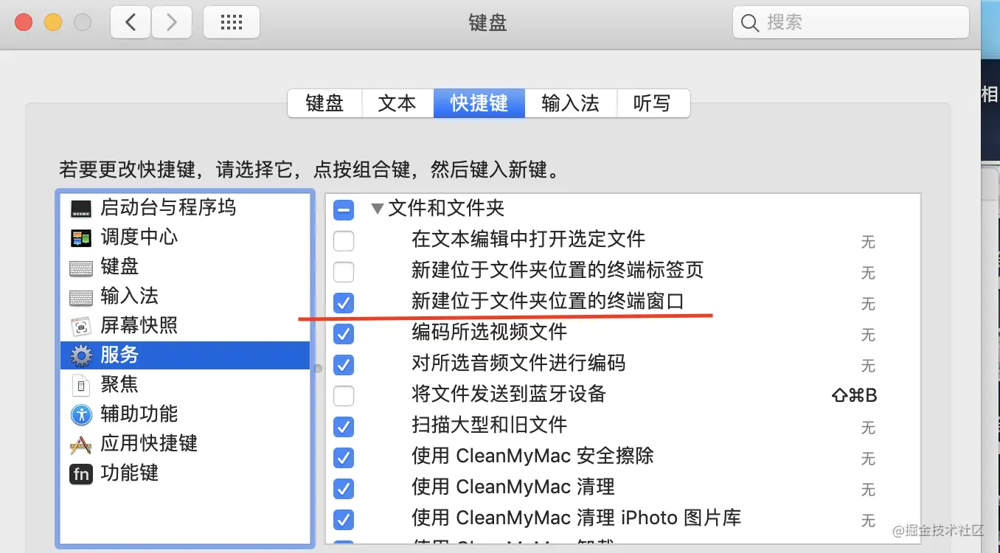
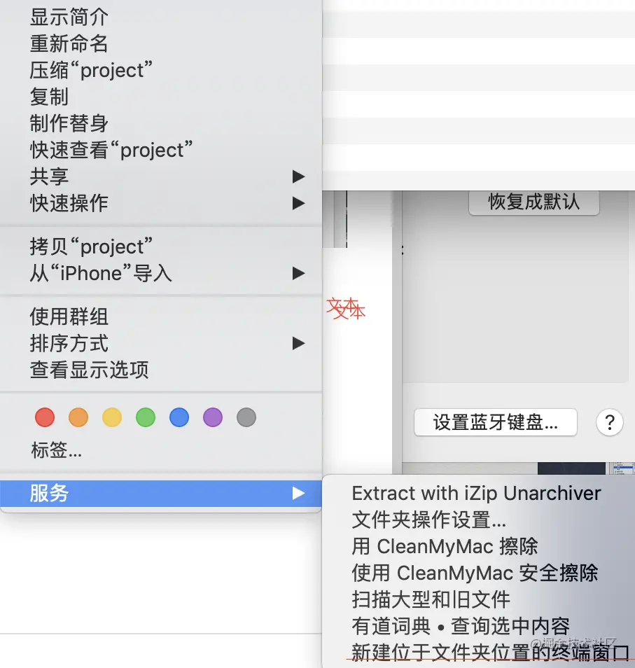
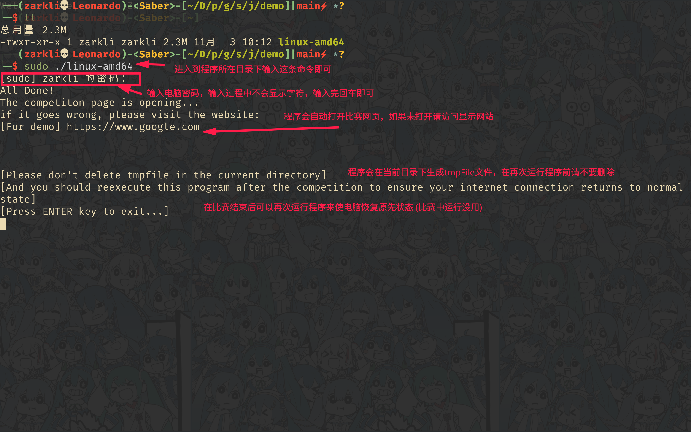

# 第三届都院程序算法趣味编程比赛 打开方式

为了保证比赛规则（参赛者不能查询网络资料），本次比赛使用本程序作为比赛的正确打开方式(当然同时也会人工监考)
比赛前15分钟我们将于比赛微信群内发放程序文件，请下载自己系统对应的文件:
- windows: windows-amd64.exe
- mac: darwin-amd64
- linux: linux-amd64

一下是三个平台的教程
## windows

## mac
为了使操作尽可能简单，我们先开启"访达"下的"在当前文件夹打开终端选项"  
操作步骤:
- 打开`访达`--->`服务`--->`服务偏好设置`：

- 勾选`新建位于文件夹位置的终端窗口`。

- 然后在`访达`里进入到当前程序目录，`右键`--->`服务`,可以看到新建终端窗口啦！

- 在终端里输入`sudo ./darwin-amd64`后回车，然后输入你帐号的密码，然后程序就会自动打开网页

## linux
linux 用户就不再多说了，直接进入到程序目录，执行`sudo ./linux-amd64`

